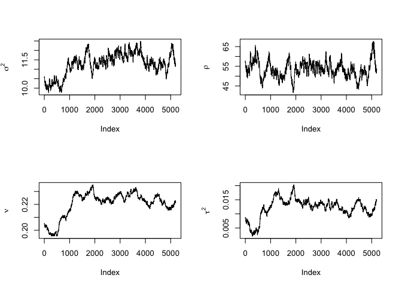
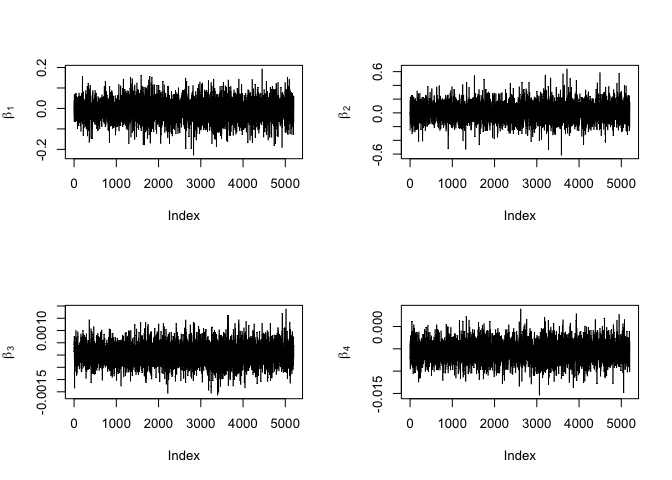
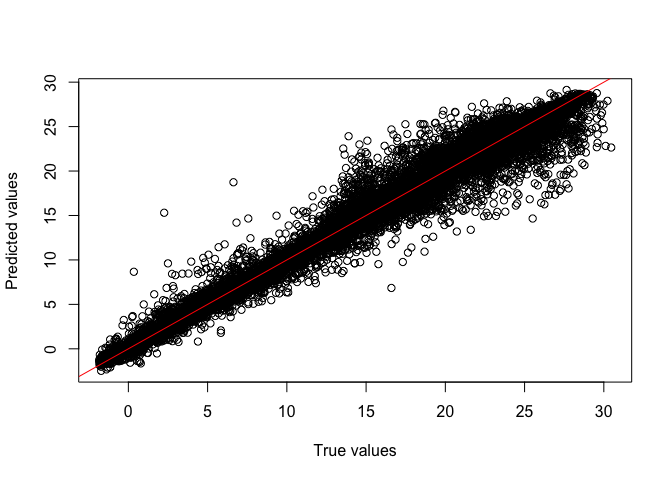
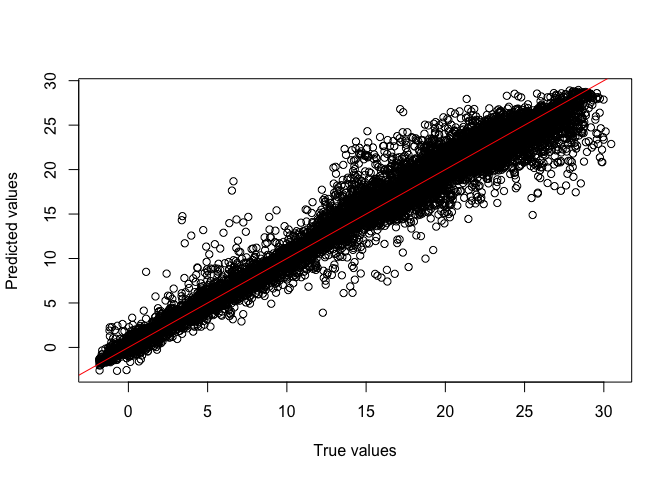

<!-- README.md is generated from README.Rmd. Please edit that file -->

# spSGMCMC

<!-- badges: start -->
<!-- badges: end -->

spSGMCMC (spatial stochastic gradient MCMC) is designed for scalable
Gaussian process (GP) regression on massive geostatistical data.
spSGMCMC employs stochastic gradient optimization instead of
conventional MCMC, where the stochastic gradients are based on terms of
the Vecchia approximated likelihood of the GP to ensure that they are
unbiased estimators of the full likelihood. The package accompanies
[this paper on arXiv](https://arxiv.org/abs/2405.04531)

## Installation

You can install the development version of spSGMCMC from
[GitHub](https://github.com/) with:

``` r
# install.packages("pak")
pak::pak("reetamm/spSGMCMC")
```

## Example

This is an example based on the Argo data used in `GpGp`. You’ll need
the `GpGp` package for this example to run, since we also use it for our
initial values.

``` r
# install.packages("GpGp")
library(GpGp)
library(spSGMCMC)
library(ggplot2)
library(tidyverse)
library(viridis)
```

``` r
## Open and plot the data
argo2016 <- GpGp::argo2016
argo2016$lon <- ifelse(argo2016$lon>180,argo2016$lon-360,argo2016$lon)
world <- map_data("world")
argoplot <- ggplot() +
  geom_map(
    data = world, map = world,
    aes(long, lat, map_id = region),
    color = "gray", fill = "white", linewidth = 0.01
  ) +
  geom_point(
    data = argo2016,
    aes(lon, lat, color = temp100),
    alpha = 0.7,size=0.1
  ) + coord_fixed()+theme_bw() +
  scale_color_viridis_c(option = "C")+
  xlab("Longitude")+
  ylab("Latitiude")+
  labs(colour = "Temp (C)")
#> Warning in geom_map(data = world, map = world, aes(long, lat, map_id = region),
#> : Ignoring unknown aesthetics: x and y
argoplot
```


``` r
##### Split into train/test
test_prop <- 0.6
test_size <- floor(nrow(argo2016)*test_prop)
id_test <- sample(1:nrow(argo2016), size = test_size)
id_train <- 1:nrow(argo2016)
id_train <- id_train[-id_test]
argo2016_test <- argo2016[id_test,]
argo2016_train <- argo2016[id_train,]

#### gpgp fit

y <- argo2016_train$temp100
X <- cbind(1, argo2016_train$lon, argo2016_train$lat, argo2016_train$lon^2, argo2016_train$lat^2)
locs = cbind(argo2016_train$lon, argo2016_train$lat)
ord <- GpGp::order_maxmin(locs = locs, lonlat = T)
NNarray <- GpGp::find_ordered_nn(locs = locs[ord,], m = 10, lonlat = T)
gpgp_fit <- GpGp::fit_model(y[ord], locs = locs[ord,], X = X[ord,], covfun_name = "matern_isotropic",
                            NNarray = NNarray, reorder = F, silent = T, m_seq = c(10))
```

``` r
##### sgrld fit
n_epoch <- 200
n_batch <- 250
lr_sgrld = 1e-4; lr_min_sgrld = 5e-5
n_burn = 5000
thin = 1
covfun_name = "matern_isotropic"
covparams_prior_params <- cbind(c(.01, 100, 1, .1), c(.01, 2, 1, .1) )
# Note that the prior for range is Gamma(100,2), which gives us a posterior mean of 50. Apt for very smooth global data
# initial values from GpGp
beta_c <- gpgp_fit$betahat; covparams0 <- gpgp_fit$covparms; initial_V <- diag(gpgp_fit$info)
sgrld_fit <- sgrld_mcmc(y=y[ord], X = X[ord,], NNarray = NNarray, locs = locs[ord,], beta_0 = beta_c,
                      covparams0 = covparams0, covfun_name ="matern_isotropic", lr = lr_sgrld,
                      lr_min = lr_min_sgrld, n_epochs = n_epoch, n_batch = n_batch, n_burn = n_burn,
                      thin = thin, covparams_prior_params = covparams_prior_params, silent = F)
#> Iteration 510, Epoch 10 
#> Iteration 1020, Epoch 20 
#> Iteration 1530, Epoch 30 
#> Iteration 2040, Epoch 40 
#> Iteration 2550, Epoch 50 
#> Iteration 3060, Epoch 60 
#> Iteration 3570, Epoch 70 
#> Iteration 4080, Epoch 80 
#> Iteration 4590, Epoch 90 
#> Iteration 5100, Epoch 100 
#> Iteration 5610, Epoch 110 
#> Iteration 6120, Epoch 120 
#> Iteration 6630, Epoch 130 
#> Iteration 7140, Epoch 140 
#> Iteration 7650, Epoch 150 
#> Iteration 8160, Epoch 160 
#> Iteration 8670, Epoch 170 
#> Iteration 9180, Epoch 180 
#> Iteration 9690, Epoch 190 
#> Iteration 10200, Epoch 200
```

``` r
#### Total time taken
sgrld_fit$elapsed_time
#> elapsed 
#>  65.891
#### Plot chains
par(mfrow = c(2,2))
library(latex2exp)
names_sgrld_plots <- c("$\\sigma^2$", "$\\rho$", "$\\nu$", "$\\tau^2$")
for(j in 1:4) plot(sgrld_fit$theta_samples[,j], ylab = TeX(names_sgrld_plots[j]), type = "l")
```



``` r
names_sgrld_beta <- c("$\\beta_1$", "$\\beta_2$", "$\\beta_3$", "$\\beta_4$")
for(j in 1:4) plot(sgrld_fit$beta_samples[,j+1], ylab = TeX(names_sgrld_beta[j]), type = "l")
```



``` r

sgrld_betahat <- colMeans(sgrld_fit$beta_samples); sgrld_thetahat <- colMeans(sgrld_fit$theta_samples)
par(mfrow=c(1,1))
```

``` r
#### Now prediction
####
y_pred <- argo2016_test$temp100
X_pred <- cbind(1, argo2016_test$lon, argo2016_test$lat, argo2016_test$lon^2, argo2016_test$lat^2)
locs_pred = cbind(argo2016_test$lon, argo2016_test$lat)
predicted <- GpGp::predictions(fit = gpgp_fit ,locs_pred = locs_pred, X_pred = X_pred, y_obs = y[ord],
                               locs_obs = locs[ord,], X_obs = X[ord,], beta = gpgp_fit$betahat,
                               covparms = gpgp_fit$covparms, covfun_name = "matern_isotropic",
                               m =15, reorder = FALSE )
plot(y_pred, predicted, xlab = "True values", ylab = "Predicted values")
abline(a=0, b = 1, col = "red")
```



``` r
#Now predicted CI
nsims <- 500
predicted_sims <- GpGp::cond_sim(fit = gpgp_fit ,locs_pred = locs_pred, X_pred = X_pred, y_obs = y[ord],
                                locs_obs = locs[ord,], X_obs = X[ord,], beta = gpgp_fit$betahat,
                                covparms = gpgp_fit$covparms, covfun_name = "matern_isotropic",
                                m =15, reorder = FALSE, nsims = nsims)
predicted_CI <- apply(predicted_sims, 1, FUN = function(x){return(quantile(x, probs = c(0.025, 0.975)))})
predicted_CI <- t(predicted_CI)
coverage_fun <- function(ci_array, true_values){
  x <- cbind(ci_array, true_values)
  covered <- apply(x, 1, FUN = function(z){
    if((z[1]>z[3]) || (z[2]<z[3])){
      return(0)
    }else{
      return(1)
    }
  })
  return(covered)
}
coverage_gpgp <- coverage_fun(predicted_CI, y_pred)
cat(paste("Average coverage of GpGp on the test set is:", round(mean(coverage_gpgp),4), ".\n"))
#> Average coverage of GpGp on the test set is: 0.9413 .
cat(paste("Mean squared error of GpGp on the test set is:", round( mean( (predicted - y_pred)^2 ), 4), ".\n"))
#> Mean squared error of GpGp on the test set is: 1.757 .
```

``` r
#### Make predictions
predicted_sgrld_mean <- GpGp::predictions(locs_pred = locs_pred, X_pred = X_pred, y_obs = y[ord],
                               locs_obs = locs[ord,], X_obs = X[ord,], beta = sgrld_betahat,
                               covparms = sgrld_thetahat, covfun_name = "matern_isotropic",
                               m =15, reorder = FALSE )
par(mfrow = c(1,1))
plot(y_pred, predicted_sgrld_mean, xlab = "True values", ylab = "Predicted values")
abline(a=0, b = 1, col = "red")
```



``` r
#Now predicted CI
library(parallel)
quantile_theta <- apply(sgrld_fit$theta_samples, MARGIN = 2, FUN = function(theta){
  return(quantile(theta, probs = seq(0.01, 0.99, 0.02)))})
mean_beta <- apply(sgrld_fit$beta_samples, MARGIN = 2, FUN = mean)
predicted_sgrld <- apply(quantile_theta, MARGIN = 1, FUN = function(theta) {
  return(GpGp::cond_sim(locs_pred = locs_pred, X_pred = X_pred, y_obs = y[ord],
                                 locs_obs = locs[ord,], X_obs = X[ord,], beta = mean_beta,
                                 covparms = theta, covfun_name = "matern_isotropic",
                                 m =15, reorder = FALSE, nsims =1))
}
)
predicted_CI_sgrld <- apply(predicted_sgrld, 1, FUN = function(x){return(quantile(x, probs = c(0.025, 0.5, 0.975)))})
predicted_CI_sgrld <- t(predicted_CI_sgrld)
```

``` r
coverage_sgrld <- coverage_fun(predicted_CI_sgrld[, c(1,3)], y_pred)
cat(paste("Average coverage of SGRLD on the test set is: ", round(mean(coverage_sgrld),4), ".\n", sep = ""))
#> Average coverage of SGRLD on the test set is: 0.9267.
cat(paste("Mean squared error of SGRLD on the test set is: ", round( mean( (predicted_sgrld_mean - y_pred)^2 ), 4), ".\n", sep = ""))
#> Mean squared error of SGRLD on the test set is: 1.7563.
cat(paste("Mean squared error of SGRLD median on the test set is: ",
          round( mean( (predicted_CI_sgrld[,2] - y_pred)^2 ), 4), ".\n", sep=""))
#> Mean squared error of SGRLD median on the test set is: 1.8018.
sgrld_ESS_beta <- coda::effectiveSize(x = sgrld_fit$beta_samples)/(sgrld_fit$elapsed_time/60)
sgrld_ESS_theta <- coda::effectiveSize(x = sgrld_fit$theta_samples)/(sgrld_fit$elapsed_time/60)
cat(paste("SGRLD ESS/min of $\\beta$ is:\n"));round(sgrld_ESS_beta, digits = 4)
#> SGRLD ESS/min of $\beta$ is:
#>     var1     var2     var3     var4     var5 
#> 4735.093 4735.093 4735.093 4735.093 4748.385
cat(paste("SGRLD ESS/min of $\\theta$ is:\n"));round(sgrld_ESS_theta, digits = 4)
#> SGRLD ESS/min of $\theta$ is:
#>    var1    var2    var3    var4 
#>  9.0929 24.8752  2.0375  3.6888
```
