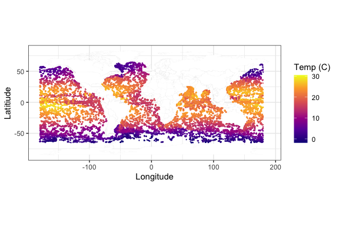

<!-- README.md is generated from README.Rmd. Please edit that file -->

# spSGMCMC

<!-- badges: start -->
<!-- badges: end -->

spSGMCMC is designed for the Bayesian inference on massive
geostatistical data using GP models which utilize stochastic gradient
optimization instead of conventional MCMC. The package accompanies [this
paper on arXiv](https://arxiv.org/abs/2405.04531)

## Installation

You can install the development version of spSGMCMC from
[GitHub](https://github.com/) with:

``` r
# install.packages("pak")
pak::pak("reetamm/spSGMCMC")
```

## Example

This is an example based on the Argo data used in `GpGp`. You’ll need
the `GpGp` package for this example to run, since we also use it for our
initial values.

``` r
# install.packages("GpGp")
library(GpGp)
library(spSGMCMC)
#> 
#> Attaching package: 'spSGMCMC'
#> The following objects are masked from 'package:GpGp':
#> 
#>     fast_Gp_sim, fast_Gp_sim_Linv, find_ordered_nn,
#>     find_ordered_nn_brute, group_obs, L_mult, L_t_mult, Linv_mult,
#>     Linv_t_mult, order_coordinate, order_dist_to_point, order_maxmin,
#>     order_middleout, vecchia_Linv, vecchia_profbeta_loglik_grad_info
library(ggplot2)
library(tidyverse)
#> ── Attaching core tidyverse packages ──────────────────────── tidyverse 2.0.0 ──
#> ✔ dplyr     1.1.4     ✔ readr     2.1.5
#> ✔ forcats   1.0.0     ✔ stringr   1.5.1
#> ✔ lubridate 1.9.3     ✔ tibble    3.2.1
#> ✔ purrr     1.0.2     ✔ tidyr     1.3.1
#> ── Conflicts ────────────────────────────────────────── tidyverse_conflicts() ──
#> ✖ dplyr::filter() masks stats::filter()
#> ✖ dplyr::lag()    masks stats::lag()
#> ℹ Use the conflicted package (<http://conflicted.r-lib.org/>) to force all conflicts to become errors
library(viridis)
#> Loading required package: viridisLite
```

``` r
## Open and plot the data
argo2016 <- GpGp::argo2016
argo2016$lon <- ifelse(argo2016$lon>180,argo2016$lon-360,argo2016$lon)
world <- map_data("world")
argoplot <- ggplot() +
  geom_map(
    data = world, map = world,
    aes(long, lat, map_id = region),
    color = "gray", fill = "white", size = 0.01
  ) +
  geom_point(
    data = argo2016,
    aes(lon, lat, color = temp100),
    alpha = 0.7,size=0.1
  ) + coord_fixed()+theme_bw() +
  scale_color_viridis_c(option = "C")+
  xlab("Longitude")+
  ylab("Latitiude")+
  labs(colour = "Temp (C)")
#> Warning: Using `size` aesthetic for lines was deprecated in ggplot2 3.4.0.
#> ℹ Please use `linewidth` instead.
#> This warning is displayed once every 8 hours.
#> Call `lifecycle::last_lifecycle_warnings()` to see where this warning was
#> generated.
#> Warning in geom_map(data = world, map = world, aes(long, lat, map_id = region),
#> : Ignoring unknown aesthetics: x and y
argoplot
```


